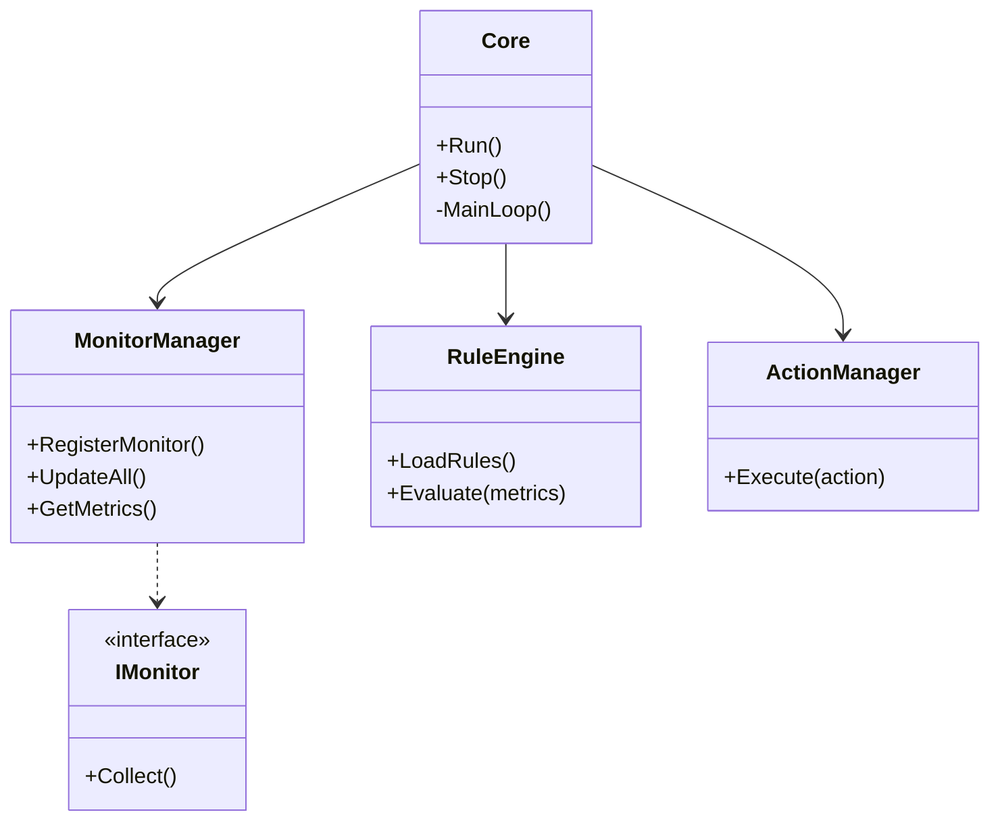

# ARCHITECTURE : Architecture Système LSAA

**Projet :** Local System Automation Agent (LSAA)
**Version :** 1.0.0
**Date :** 02/02/2026

## 1. Principes Architecturaux

- **Modularité :** Séparation stricte entre Observation (Monitors), Raisonnement (Rules) et Action (Effectors).
- **Performance :** "Zero-cost abstractions" du C++20. Allocation mémoire statique ou au démarrage privilégiée.
- **Robustesse :** Pas d'exceptions dans la boucle critique. Gestion d'erreur explicite (`std::expected` ou codes d'erreur).
- **Indépendance :** Le Core doit fonctionner sans UI (Headless). L'UI est un client du Core (via mémoire partagée ou IPC léger si séparation processus, ici intégré dans le même binaire au début mais logiquement séparé).

## 2. Vue d'Ensemble (High-Level Design)

Le système est composé de 4 couches principales :

1.  **HAL (Hardware Abstraction Layer) / OS Layer :** Wrappers autour de WinAPI (et futurs syscalls Linux).
2.  **Core Services :** Boucle principale, Logging, Configuration, Gestionnaire de Modules.
3.  **Engine Layer :**
    - **Observer Engine :** Collecte les métriques.
    - **Reasoning Engine :** Évalue les règles.
    - **Action Engine :** Exécute les commandes.
4.  **Application Layer :** CLI, GUI (ImGui), API Locale.



## 3. Composants Detaillés

### 3.1. Structure du Projet (C++20 / CMake)

```
/src
  /core         # Boucle principale, Config, Log
  /monitors     # Implémentations (CpuMonitor, RamMonitor...)
  /engine       # RuleEngine, ActionManager
  /ui           # ImGui wrapper, Windows
  /utils        # Helpers (String, Time, OS)
  main.cpp      # Point d'entrée
/include        # Headers publics
/tests          # Tests unitaires (GTest)
/external       # Dépendances (fmt, nlohmann_json, imgui)
```

### 3.2. Modèle d'Exécution

- **Single-Threaded Dominant :** Le Core tourne sur un thread principal pour éviter les context switches coûteux et les race conditions.
- **Non-Bloquant :** Toutes les opérations I/O (disque, réseau, exécution processus) doivent être asynchrones ou très rapides.
- **Worker Thread (Optionnel) :** Pour les Actions lourdes, un thread séparé ou un pool minimal peut être utilisé, communiquant via une queue thread-safe.

### 3.3. Gestion des Données

- **Métrique :** Stockée sous forme de vecteurs de variantes ou structures typées (`struct SystemMetrics`).
- **Configuration :** Fichiers JSON chargés au démarrage. Hot-reload prévu.

## 4. Stratégie de Build & Déploiement

- **CMake :** Générateur universel.
- **Static Linking :** Privilégier le lien statique pour un exécutable unique portable (sauf DLLs système).
- **CI/CD Local :** Scripts PowerShell pour build, test et check (Clang-Tidy, CppCheck).

## 5. Sécurité

- **Principe de Moindre Privilège :** L'agent tourne avec les droits de l'utilisateur par défaut. L'élévation (Admin) n'est demandée que si configurée et nécessaire pour certaines actions.
- **Validation des Inputs :** Les fichiers de configuration et scripts externes sont validés avant chargement/exécution.
